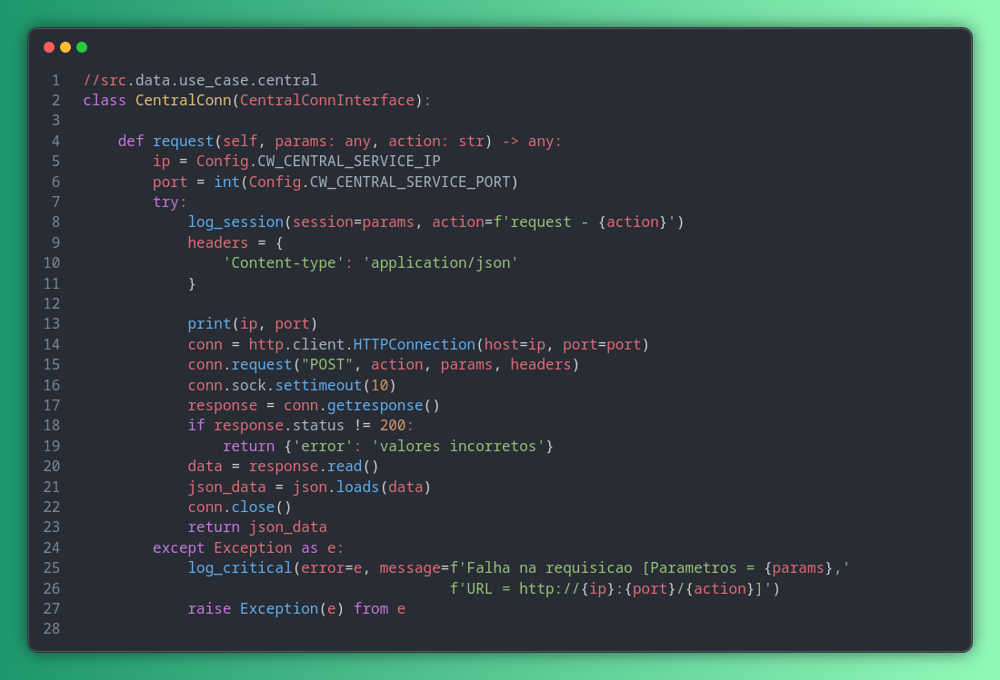

# CardinalWave: Um serviço de comunicação idependente

Este projeto contem um aplicação completa de desenvolvida para demonstrar a utilziação da rede CardinalCloud construida ao longo do projeto. Sua principal função e demonstrar a simplicidade e a utilização dos conceitos desenvolvidos ao longo do curso, atraves da disponibilização de um serviço de comunicação com funcionamento externo as redes convencionais.
Demonstrando o pleno funcionamento das integrações entre microcontroladores e usuaurios presentes na rede, alem de insentivar novas aplicações criadas pela comunidade de desenovolvimento.

O exemplo foi projetado para ser usado em um cenario em que a comunicacao via internet se encontra inutilizada em um determinada região, e á necessidade da comunicação entre os afetados.

O objetivo do programa é permitir que qualquer pessoa que tenha a disponibilidade algum meio de conexão a rede Wi-Fi, consiga se conectar a rede CardinalCloud, e acessar a aplicação criada, possibilitando um meio de contato na regiao local.

Como nosso objetivo com está aplicação é realizar a comunicação entre úsuario conectados á rede. Em nosso projeto contamos com operação de: (1) gerenciamento de conta (login de usuario e registro), (2) gerenciamento de grupos (criar e entrar) e (3)envio de mensagens.

<p align="center">
    
</p>

No restante deste documento vamos:

-   Descrever o sistema, com foco na sua arquitetura.
-   Apresentar instruções para sua execução local, usando o código disponibilizado no repositório.
-   Operações implementas, e seu funcionamento entre os serviços.
-   Funcionamento dos containers Docker para facilitar a execução dos microsserviços.

## Arquitetura

CardinalWave possui seis microsserviços:

-   cw-bff-service: microsserviço responsável pela interface e o processo de Bridge (Ponte) entre os protocolos MQTT e WebSocket.
-   cw-mqtt-gateway: microsserviço responsável por intermediar a comunicação entre o broker Mosquitto-MQTT e o demais serviços.
-   cw-central-service: microserviço para centralização dos processos.
-   cw-auth-service: microserviço utilizado para a authenticação do usuario.
-   cw-log-trace: microserviço responsável pelo gerenciamento de logs gerados pelas demais aplicações.

Os seis microsserviços estão implementados em **Python**, usando o Flask para execução dos serviços no back-end.

Tambem contamos com a utilização de bancos de dados e serviços externos.
-   cw_central_db: banco de dados conectado a cw-central-service, sua principal função é gerenciar sessoes e grupos.

-   cw_message_db: banco de dados conectado a cw-message-service, sua principal função é gerenciar chats ativos e mensagens.

-   keycloak: serviço utilizado para autenticar e gerar o token do usuario.

-   Mosquitto-Broker (Broker): Broker utilizado para gerir os eventos publicados e entregar para os servicos inscritos nos topicos presentes.

## Protocolos de Comunicação

Como ilustrado no diagrama a seguir, a comunicação entre o cliente (cw-bff-service) e o backend usa um **BROKER**, como é comum no caso de sistemas que utilizam eventos para gerenciamento de suas ações.

Já a comunicação entre o cw-mqtt-gateway e os microsserviços do back-end é baseada em [REST](https://grpc.io/).

Definimos dois principais tipos de requisições gerais da aplicação afim de aproveitar a extensibilidade presente no protocolo MQTT e a utilização de REST por sua preseça na maioria dos frameworks Python.
Temos então, ações simples, aqueles que mantem o processamento da requisição apenas entre os serviços descritos na imagem.

<p align="center">
    
</p>
 - Ação Simples

#### Ação Simples
Nesta exemplificação do sistema temos a representação das ações consideradas simples, em que as requisições do usuario interagem apenas com os microserviços descritos, o todo o processamento ocorre em grande parte em **CW-CENTRAL-SERVICE**, e os componentes em que está conectado. Estes eventos são relacionados a interações individuais do úsuario sendo neste caso:
    
    - Login: Quando o usuario entra em sua conta.
    - Registrar: O úsuario cria sua conta.
    - Criar grupo: Requisição para a criação de um novo grupo
    - Entrar no Grupo: Requisição para a entrada em um grupo ja criado 
    - Entrar no Chat: Requisção para a entrada em um chat de grupo
    - Erros de requisição

Desta forma simplificamos o processo das requisições em apenas um conjunto do sistema reduzindo possiveis acolamentos, nestas ações o retorno da requisição é feita atraves do **CW-MQTT-GATEWAY**, com a realização de tratamentos para a publicação da resposta processada pelos demais serviçõs do conjunto.

Vale resaltar que o serviçõ criado para coleta de logs tambem interage com os demais serviços que serão apresentados.

<p align="center">
    
</p>
 - Ação Complexa
 
#### Ação Complexa
Neste conjunto temos um simplificação do sistema em que podemos visualizar os componentes principais das ações consideradas complexas, aquelas em que o processamento da informação e divido em 2 ou mais serviçõs, **CW-CENTRAL-SERVICE** e **CW-MESSAGE-SERVICE**, em que cada um exerce um papel durante o processamento da requisição, sendo **CW-CENTRAL-SERVICE** utilizado para a validação de dados do úsuario e demais informações da requisição, dessa forma garantimos uma menor complexidade no envio das mensagens, sendo **CW-MESSAGE-SERVICE**, apenas utilizado para identificar os membros conectados a um chat em especifico para o recebimento e tratamento de mensagens e para a publicação das mesmas atraves da conexão ao broker.

Optamos por usar MQTT e HTTP no nosso sistema devido às vantagens que cada um desses protocolos oferece em diferentes contextos de comunicação. Cada um tem características que o tornam adequado para determinadas situações, permitindo um equilíbrio ideal entre eficiência e flexibilidade. A seguir vamos explorar as vantagens de cada um desse protocolos e como eles são aplicados em nosso contexto:

### MQTT: Eficiência e Escalabilidade para IOT
O MQTT (Message Queuing Telemetry Transport) é um protocolo de comunicação baseado no modelo publish/subscribe (publicar/assinar), o que o torna altamente eficiente em ambientes com múltiplas conexões simultaneas e idenpendetes. Utilizamos este protocolo em nosso projeto por conta de sua operação ser realizada mesmo em ambientes instaveis ou de baixa largura de banda, atendo de forma eficiente as demandas de conexões entre os microcontroladores e as aplicações da rede.
 - Protocolo leve que utiliza pacotes pequenos para trafegar informações entre a inscricao e a assinatura.
 - Facilidade na integração com plataformas diferentes.

### REST: Simplicidade e Flexibilidade para Integração
O REST (Representational State Transfer) é um estilo de arquitetura amplamente utilizado para a construção de APIs e serviços distribuidos, sendo baseado em operaçãoes simples de requisição HTTP (GET, POST, PUT, DELETE) e no conceito da identificação de recursos por URLs disponibilizadas pelo serviço. Sendo uma vantagem quando a necessidade da simplificação de iterações entre os serviços. 

    - Simplicidade nas chamadas.
    - Ubidquidade na nomeação das URLs de acesso, promovendo uma linguagem familiar no consumo de recursos das APIs.


Optamos por usar REST e MQTT no sistema devido às suas vantagens distintas em termos de simplicidade, flexibilidade e eficiência em diferentes cenários de comunicação. Embora ambos sejam protocolos amplamente utilizados, eles atendem a necessidades específicas e têm características que os tornam ideais para contextos diferentes.
O REST sendo utilizado neste caso para a simplificação da integração aos serviços que não necessitam de esposição ao contexo direto do úsuario, facilitando o desacoplamento e a construção de modulos idenpendetes. Para os casos em que a coneão externa é necessario como no caso de rotornos ao cliente, o protocolo MQTT compre está função, se responsabilizando pela publicação e distribuição dos eventos.


### Exemplo do funcionamento das conexões

Quando trabalhamos com MQTT, cada publicação possui um tópico que define a assinatura das operações que ele realiza para os outros microsserviços inscritos no broker.
Nesta publicação definimos parametros que serão utilizados pelos demais serviços durante o processamento e qual o evento acionado e a identificação do usuario e dispositivo de acesso utilizado.
O exemplo a seguir uma execução de evento de login do nosso microsserviço **CW-BFF-SERVICE** ou de um de nossos microcontroladores conectados. Nele, definimos que esse microsserviço realiza uma requisição `login`. Para chamar essa função devemos passar como parâmetro de entrada um objeto contendo os dados de acesso do usuario (`payload`). Após sua execução, a função retorna como resultado uma outra publicação com o topico (`server`), seguido pela (`session_id`) do usuario e o (`evento`), com payload o token gerado para essa sessão.

<p align="center">
    
</p>
-- Publicação de login do lado do cliente

<p align="center">
    
</p>
-- Publicacao de login do lado do servidor

Em MQTT, as publicações são formadas por um conjunto de parametros denominados topico (`topic`), que definimos com parametros como a identificação dos dispositivos, sessão da chamada e ação executada, dessa forma conseguimos criar uma estrutura flexivel e compativel com os requisitos dos multiplos sistemas da rede. O tramento destas requisições ocorre em **CW-MQTT-SERVICE**, como no seguinte exemplo:

<p align="center">
    
</p>

Podemos observer que atraves do metodo (`on_message`), executado sempre que recebe uma nova mensagem, realizamos a chamada para o (`TopicManager`), onde realizamos a deserialização da publicação recebida e envimos e excutamos os processos necessarios para o processamento do evento.

<p align="center">
    
</p>
-- TopicManager

Desse forma centralizamos a idenficação dos eventos e possiveis erros.
As requisições para **CW-CENTRAL-SERVICE** seguem o mesmo processo em todos os eventos, de forma simplificada, a adição de um novo evento depende apenas da alteração em (`TopicManager`) e seu tratamento especifico, embora sua requisição permaça igual aos demais.

<p align="center">
    
</p>
-- integracao_central.png


Apos a requisição, o **CW-CENTRAL-SERVICE** incia o processamento da ação realizada, neste caso se trata da primeira conexão do cliente á aplicação, sendo necessario a geração de um token que sera retornado e utilizado pelo cliente nos demais eventos executados. Esse token tem um prazo definido e seu criação e resposabilidade do **Keycloak**, tornando a idenficação do cliente mais segura dentro do sistema.

<p align="center">
    
</p>
-- user_route.png

Para uma melhor visualização dos processos que ocorrem durante o tratamento de um evento, utilizamos o padrão **Composer**, utilizado em todas as ações deste serviços e presente em grande parte das aplicações do conjunto.

<p align="center">
    
</p>
-- user_login_composer.png

A requisição para **CW-AUTH-SERVICE**, executada principalmente nas ações de (`login`) e (`register`), acontece de forma semelhante ao procedimento realizado para a chamadas para **CW-CENTRAL-SERVICE** presente em **CW-MQTT-GATEWAY**:

<p align="center">
    
</p>
-- auth_request.png

Esses são os procedimentos basicos utilizados nas requisições simples, em que a resposta ao usuario conta apenas com a utilização principal do **CW-CENTRAL-SERVICE**, sendo entregue o retorno atraves das funções executadas em sequencia entre os serviços.

Nas ocasioes em que o evento utiliza ações complexas, o procedimento deve prosseguir atraves da execução de **CW-MESSAGE-SERVICE**, como no seguinte exemplo em que um cliente conectado realiza a operação de envio de mensagem, os processos descritos anteriormente são mantidos tendo como difereça principal a utilização deste serviço para a publicação da mensagem.

<p align="center">
    
</p>
-- forward_message.py

Quando um requisição é recebida por **CW-MESSAGE-SERVICE** ela pode executar as tres seguintes ações:

    - /chat/join - Usuario entra no chat de um grupo em que esta cadastrado
    - /chat/leave - Saida de um usuario do chat de um grupo
    - /chat/send - Envio de mensagem

<p align="center">
    
</p>
-- actions_routes.py

As ações de (`join`) e (`leave`), possuem um funcionamento inverso, uma vez que um usuario envia uma ação de entrada em um chat, o evento é processado atraves do metodo (`join_composer`).

<p align="center">
    
</p>
-- join_composer.py

Em que realiza a execuação dos metodos de iniciação do tratamento da ação enque os dados da requisção são submetidos ao bando de dados **CW_MESSAGE_DB**, na tabela **Sessions** afim de cadastrar o chat em que o usuario necessita receber as mensagens presentes na tabela **Messages**, e novas publicações. Quando a ação (`leave`) ocorre, o processo inverso é realizado, deletando os dados da tabela responsavel pela assoaciação da entrada do usuario ao chat.

<p align="center">
    
</p>
-- join_leave.png

Para o controle das mensagens enviadas pelos usuarios contamos com uma tabela de armazenamento de mensagens presente em **CW_MESSAGE_DB**, possibilitando o arquivamento destas informações para posterior utilização, o controle destes eventos é realizado principalmente em  (`MessageManager`), em que contamos com métodos utilizados tanto para o envio de novas mensagens como (`forward_message`), para o envio de mensagens ao usuario com a sua entrada no chat (`inbox`) e para a gravação no banco de dados (`save_message`)

<p align="center">
    
</p>
-- MessageManager.png

Dessa forma, quando o usuario entra no chat, temos além do evento de entrada e a possibilidade de enviar mensagens a outros usuarios, a realização do envio das mensagens presentes no grupo anteriormente.

A publicação destas mensagens no broker ocorre atraves do metodo (`message_publish`), tendo como diferenciação a utilização em lote no caso de `inbox` e o envio individual em `forward_message`

<p align="center">
    
</p>
-- message_publish.png


-----------------------------------------------------------
Um grande ponto de ateção em nosso sistema está em nosso serviço **CW-BFF-SERVICE** e nas possiveis conexões de dispositivos **ESP-8266** encontrados em nossa rede. A forma de construção utilizada para o frontend de nosso sistema e a realizações de o


## Executando o Sistema

A seguir vamos descrever a sequência de passos para você executar o sistema localmente em sua máquina. Ou seja, todos os microsserviços estarão rodando na sua máquina.

**IMPORTANTE:** Você deve seguir esses passos antes de implementar as tarefas práticas descritas nas próximas seções.

1. Faça um fork do repositório. Para isso, basta clicar no botão **Fork** no canto superior direito desta página.

2. Vá para o terminal do seu sistema operacional e clone o projeto (lembre-se de incluir o seu usuário GitHub na URL antes de executar)

```
git clone https://github.com/<SEU USUÁRIO>/micro-livraria.git
```

3. É também necessário ter o Node.js instalado na sua máquina. Se você não tem, siga as instruções para instalação contidas nessa [página](https://nodejs.org/en/download/).

4. Em um terminal, vá para o diretório no qual o projeto foi clonado e instale as dependências necessárias para execução dos microsserviços:

```
cd micro-livraria
npm install
```

5. Inicie os microsserviços através do comando:

```
npm run start
```

6.  Para fins de teste, efetue uma requisição para o microsserviço reponsável pela API do backend.

-   Se tiver o `curl` instalado na sua máquina, basta usar:

```
curl -i -X GET http://localhost:3000/products
```

-   Caso contrário, você pode fazer uma requisição acessando, no seu navegador, a seguinte URL: `http://localhost:3000/products`.

7. Teste agora o sistema como um todo, abrindo o front-end em um navegador: http://localhost:5000. Faça então um teste das principais funcionalidades da livraria.

## Tarefa Prática #1: Implementando uma Nova Operação

Nesta primeira tarefa, você irá implementar uma nova operação no serviço `Inventory`. Essa operação, chamada `SearchProductByID` vai pesquisar por um produto, dado o seu ID.

Como descrito anteriormente, as assinaturas das operações de cada microsserviço são definidas em um arquivo `.proto`, no caso [proto/inventory.proto](https://github.com/aserg-ufmg/micro-livraria/blob/main/proto/inventory.proto).

#### Passo 1

Primeiro, você deve declarar a assinatura da nova operação. Para isso, inclua a definição dessa assinatura no referido arquivo `.proto` (na linha logo após a assinatura da função `SearchAllProducts`):

```proto
service InventoryService {
    rpc SearchAllProducts(Empty) returns (ProductsResponse) {}
    rpc SearchProductByID(Payload) returns (ProductResponse) {}
}
```

Em outras palavras, você está definindo que o microsserviço `Inventory` vai responder a uma nova requisição, chamada `SearchProductByID`, que tem como parâmetro de entrada um objeto do tipo `Payload` e como parâmetro de saída um objeto do tipo `ProductResponse`.

#### Passo 2

Inclua também no mesmo arquivo a declaração do tipo do objeto `Payload`, o qual apenas contém o ID do produto a ser pesquisado.

```proto
message Payload {
    int32 id = 1;
}
```

Veja que `ProductResponse` -- isto é, o tipo de retorno da operação -- já está declarado mais abaixo no arquivo `proto`:

```proto
message ProductsResponse {
    repeated ProductResponse products = 1;
}
```

Ou seja, a resposta da nossa requisição conterá um único campo, do tipo `ProductResponse`, que também já está implementando no mesmo arquivo:

```proto
message ProductResponse {
    int32 id = 1;
    string name = 2;
    int32 quantity = 3;
    float price = 4;
    string photo = 5;
    string author = 6;
}
```

#### Passo 3

Agora você deve implementar a função `SearchProductByID` no arquivo [services/inventory/index.js](https://github.com/aserg-ufmg/micro-livraria/blob/main/services/inventory/index.js).

Reforçando, no passo anterior, apenas declaramos a assinatura dessa função. Então, agora, vamos prover uma implementação para ela.

Para isso, você precisa implementar a função requerida pelo segundo parâmetro da função `server.addService`, localizada na linha 17 do arquivo [services/inventory/index.js](https://github.com/aserg-ufmg/micro-livraria/blob/main/services/inventory/index.js).

De forma semelhante à função `SearchAllProducts`, que já está implementada, você deve adicionar o corpo da função `SearchProductByID` com a lógica de pesquisa de produtos por ID. Este código deve ser adicionado logo após o `SearchAllProducts` na linha 23.

```js
    SearchProductByID: (payload, callback) => {
        callback(
            null,
            products.find((product) => product.id == payload.request.id)
        );
    },
```

A função acima usa o método `find` para pesquisar em `products` pelo ID de produto fornecido. Veja que:

-   `payload` é o parâmetro de entrada do nosso serviço, conforme definido antes no arquivo .proto (passo 2). Ele armazena o ID do produto que queremos pesquisar. Para acessar esse ID basta escrever `payload.request.id`.

-   `product` é uma unidade de produto a ser pesquisado pela função `find` (nativa de JavaScript). Essa pesquisa é feita em todos os items da lista de produtos até que um primeiro `product` atenda a condição de busca, isto é `product.id == payload.request.id`.

-   [products](https://github.com/aserg-ufmg/micro-livraria/blob/main/services/inventory/products.json) é um arquivo JSON que contém a descrição dos livros à venda na livraria.

-   `callback` é uma função que deve ser invocada com dois parâmetros:
    -   O primeiro parâmetro é um objeto de erro, caso ocorra. No nosso exemplo nenhum erro será retornado, portanto `null`.
    -   O segundo parâmetro é o resultado da função, no nosso caso um `ProductResponse`, assim como definido no arquivo [proto/inventory.proto](https://github.com/aserg-ufmg/micro-livraria/blob/main/proto/inventory.proto).

#### Passo 4

Para finalizar, temos que incluir a função `SearchProductByID` em nosso `Controller`. Para isso, você deve incluir uma nova rota `/product/{id}` que receberá o ID do produto como parâmetro. Na definição da rota, você deve também incluir a chamada para o método definido no Passo 3.

Sendo mais específico, o seguinte trecho de código deve ser adicionado na linha 44 do arquivo [services/controller/index.js](https://github.com/aserg-ufmg/micro-livraria/blob/main/services/controller/index.js), logo após a rota `/shipping/:cep`.

```js
app.get('/product/:id', (req, res, next) => {
    // Chama método do microsserviço.
    inventory.SearchProductByID({ id: req.params.id }, (err, product) => {
        // Se ocorrer algum erro de comunicação
        // com o microsserviço, retorna para o navegador.
        if (err) {
            console.error(err);
            res.status(500).send({ error: 'something failed :(' });
        } else {
            // Caso contrário, retorna resultado do
            // microsserviço (um arquivo JSON) com os dados
            // do produto pesquisado
            res.json(product);
        }
    });
});
```

Finalize, efetuando uma chamada no novo endpoint da API: http://localhost:3000/product/1

Para ficar claro: até aqui, apenas implementamos a nova operação no backend. A sua incorporação no frontend ficará pendente, pois requer mudar a interface Web, para, por exemplo, incluir um botão "Pesquisar Livro".

**IMPORTANTE**: Se tudo funcionou corretamente, dê um **COMMIT & PUSH** (e certifique-se de que seu repositório no GitHub foi atualizado; isso é fundamental para seu trabalho ser devidamente corrigido).

```bash
git add --all
git commit -m "Tarefa prática #1 - Microservices"
git push origin main
```

## Tarefa Prática #2: Criando um Container Docker

Nesta segunda tarefa, você irá criar um container Docker para o seu microserviço. Os containers são importantes para isolar e distribuir os microserviços em ambientes de produção. Em outras palavras, uma vez "copiado" para um container, um microsserviço pode ser executado em qualquer ambiente, seja ele sua máquina local, o servidor de sua universidade, ou um sistema de cloud (como Amazon AWS, Google Cloud, etc).

Como nosso primeiro objetivo é didático, iremos criar apenas uma imagem Docker para exemplificar o uso de containers.

Caso você não tenha o Docker instaldo em sua máquina, é preciso instalá-lo antes de iniciar a tarefa. Um passo-a-passo de instalação pode ser encontrado na [documentação oficial](https://docs.docker.com/get-docker/).

#### Passo 1

Crie um arquivo na raiz do projeto com o nome `shipping.Dockerfile`. Este arquivo armazenará as instruções para criação de uma imagem Docker para o serviço `Shipping`.

Como ilustrado na próxima figura, o Dockerfile é utilizado para gerar uma imagem. A partir dessa imagem, você pode criar várias instâncias de uma aplicação. Com isso, conseguimos escalar o microsserviço de `Shipping` de forma horizontal.

<p align="center">
    
</p>

No Dockerfile, você precisa incluir cinco instruções

-   `FROM`: tecnologia que será a base de criação da imagem.
-   `WORKDIR`: diretório da imagem na qual os comandos serão executados.
-   `COPY`: comando para copiar o código fonte para a imagem.
-   `RUN`: comando para instalação de dependências.
-   `CMD`: comando para executar o seu código quando o container for criado.

Ou seja, nosso Dockerfile terá as seguintes linhas:

```Dockerfile
# Imagem base derivada do Node
FROM node

# Diretório de trabalho
WORKDIR /app

# Comando para copiar os arquivos para a pasta /app da imagem
COPY . /app

# Comando para instalar as dependências
RUN npm install

# Comando para inicializar (executar) a aplicação
CMD ["node", "/app/services/shipping/index.js"]
```

#### Passo 2

Agora nós vamos compilar o Dockerfile e criar a imagem. Para isto, execute o seguinte comando em um terminal do seu sistema operacional (esse comando precisa ser executado na raiz do projeto; ele pode também demorar um pouco mais para ser executado).

```
docker build -t micro-livraria/shipping -f shipping.Dockerfile ./
```

onde:

-   `docker build`: comando de compilação do Docker.
-   `-t micro-livraria/shipping`: tag de identificação da imagem criada.
-   `-f shipping.Dockerfile`: dockerfile a ser compilado.

O `./` no final indica que estamos executando os comandos do Dockerfile tendo como referência a raiz do projeto.

#### Passo 3

Antes de iniciar o serviço via container Docker, precisamos remover a inicialização do serviço de Shipping do comando `npm run start`. Para isso, basta remover o sub-comando `start-shipping` localizado na linha 7 do arquivo [package.json](https://github.com/aserg-ufmg/micro-livraria/blob/main/package.json), conforme mostrado no próximo diff (a linha com o símbolo "-" no início representa a linha original do arquivo; a linha com o símbolo "+" representa como essa linha deve ficar após a sua alteração):

```diff
diff --git a/package.json b/package.json
index 25ff65c..552a04e 100644
--- a/package.json
+++ b/package.json
@@ -4,7 +4,7 @@
     "description": "Toy example of microservice",
     "main": "",
     "scripts": {
-        "start": "run-p start-frontend start-controller start-shipping start-inventory",
+        "start": "run-p start-frontend start-controller start-inventory",
         "start-controller": "nodemon services/controller/index.js",
         "start-shipping": "nodemon services/shipping/index.js",
         "start-inventory": "nodemon services/inventory/index.js",

```

Em seguida, você precisa parar o comando antigo (basta usar um CTRL-C no terminal) e rodar o comando `npm run start` para efetuar as mudanças.

Por fim, para executar a imagem criada no passo anterior (ou seja, colocar de novo o microsserviço de `Shipping` no ar), basta usar o comando:

```
docker run -ti --name shipping -p 3001:3001 micro-livraria/shipping
```

onde:

-   `docker run`: comando de execução de uma imagem docker.
-   `-ti`: habilita a interação com o container via terminal.
-   `--name shipping`: define o nome do container criado.
-   `-p 3001:3001`: redireciona a porta 3001 do container para sua máquina.
-   `micro-livraria/shipping`: especifica qual a imagem deve-se executar.

Se tudo estiver correto, você irá receber a seguinte mensagem em seu terminal:

```
Shipping Service running
```

E o Controller pode acessar o serviço diretamente através do container Docker.

**Mas qual foi exatamente a vantagem de criar esse container?** Agora, você pode levá-lo para qualquer máquina ou sistema operacional e colocar o microsserviço para rodar sem instalar mais nada (incluindo bibliotecas, dependências externas, módulos de runtime, etc). Isso vai ocorrer com containers implementados em JavaScript, como no nosso exemplo, mas também com containers implementados em qualquer outra linguagem.

**IMPORTANTE**: Se tudo funcionou corretamente, dê um **COMMIT & PUSH** (e certifique-se de que seu repositório no GitHub foi atualizado; isso é fundamental para seu trabalho ser devidamente corrigido).

```bash
git add --all
git commit -m "Tarefa prática #2 - Docker"
git push origin main
```

## Comentários Finais

Nesta aula, trabalhamos em uma aplicação baseada em microsserviços. Apesar de pequena, ela ilustra os princípios básicos de microsserviços, bem como algumas tecnologias importantes quando se implementa esse tipo de arquitetura.

No entanto, é importante ressaltar que em uma aplicação real existem outros componentes, como bancos de dados, balanceadores de carga e orquestradores.

A função de um **balanceador de carga** é dividir as requisições quando temos mais de uma instância do mesmo microsserviço. Imagine que o microsserviço de frete da loja virtual ficou sobrecarregado e, então, tivemos que colocar para rodar múltiplas instâncias do mesmo. Nesse caso, precisamos de um balanceador para dividir as requisições que chegam entre essas instâncias.

Já um **orquestrador** gerencia o ciclo de vida de containers. Por exemplo, se um servidor para de funcionar, ele automaticamente move os seus containers para um outro servidor. Se o número de acessos ao sistema aumenta bruscamente, um orquestrador também aumenta, em seguida, o número de containers. [Kubernetes](https://kubernetes.io/) é um dos orquestradores mais usados atualmente.

Se quiser estudar um segundo sistema de demonstração de microsserviços, sugerimos este [repositório](https://github.com/GoogleCloudPlatform/microservices-demo), mantido pelo serviço de nuvem do Google.

## Créditos

Este exercício prático, incluindo o seu código, foi elaborado por **Rodrigo Brito**, aluno de mestrado do DCC/UFMG, como parte das suas atividades na disciplina Estágio em Docência, cursada em 2020/2, sob orientação do **Prof. Marco Tulio Valente**.

O código deste repositório possui uma licença MIT. O roteiro descrito acima possui uma licença CC-BY.
